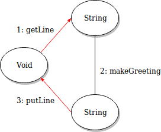
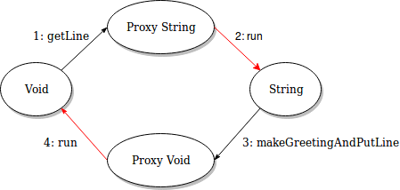
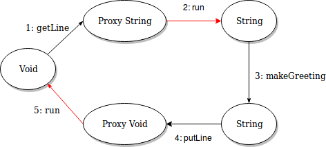
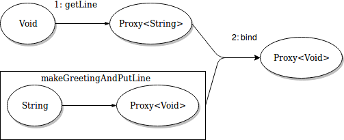

# A practical introduction of Monads

Monads in programming are mainly used for isolation/extraction of some functionality from other
parts of the code. It might be done for separation of concerns or isolation of impure code from
the main program.

Here we’ll do the latter reinventing a simplified Monad-like concept out of necessity. We’ll start
with a simple program below and step-by-step isolate all pure code from IO operations
(the impure part). The end goal is to split our program in two separate parts: pure part will do
nothing visible, but it will contain all required program logic, and the other part will solely be
responsible for all IO operations.

## The program

Python language will be used for simplicity with Haskell-style function signatures in the comments
for clarity.

~~~python
name = getLine()              # Void -> String
greeting = makeGreeting(name) # String -> String
putLine(greeting)             # String -> Void
~~~

The methods in red are not pure due to side-effects.

### Step 1: Separating all pureness

Asking user for a name is a part of the program logic and we can separate it from IO by splitting
our `getLine` method to two. The first part will be the request to get a `String` which
would return a `String` proxy and the second part will do the actual IO work with side effects.

Here is the result with a similar change for the other impure method `putLine`:

~~~python
getLineProxy = getLine()         # Void -> Proxy String
name = getLineProxy.run()        # Proxy String -> String
greeting = makeGreeting(name)    # String -> String
putLineProxy = putLine(greeting) # String -> Proxy Void
putLineProxy.run()               # Proxy Void -> Void
~~~

Now all side effects are located in run methods which extract values from its proxies,
but we haven’t achieved our ultimate goal yet which to split the program in two parts.

### Step 2: Simplification - composing pure functions

We can always compose normal pure functions (the ones not returning Proxies).
Let's do that by introducing one pure function
~~~python
putLineProxy = makeGreetingAndPutLine(name) # String -> Proxy Void
~~~
instead of two pure functions
~~~python
greeting = makeGreeting(name)    # String -> String
putLineProxy = putLine(greeting) # String -> Proxy Void
~~~

We ended up with a sequence of pure functions in the form
~~~haskell
A -> Proxy B
~~~
with impure ones in between
~~~haskell
Proxy A -> A
~~~

### Step 3: Sequencing pure parts to form the program

We need to have a way to pass the `String` from `getLineProxy` to `makeGreetingAndPutLine` function.
In other words we need a way to compose pure parts of the program which are seemingly incompatible.

It's always possible to call the first Proxy-producing function in the pure part of the program,
but running the resulted `Proxy` to get the required `String` value has side-effects. So we need
to combine an existing `Proxy` instance with another `Proxy`-producing function, like this:
~~~python
bind(getLineProxy, makeGreetingAndPutLine) # (Proxy String, String -> Proxy Void) -> Proxy Void
~~~

Similar to run method the implementation is left to the `Proxy` internals - we’re only expressing
our intention to form a sequence of executions.

The diagram below shows the pure part of our program. Note that we only make two actual function
calls (`makeGreetingAndPutLine` is passed in as a function reference).

See [program3.py](program3.py) for its simplified implementation.

## The Monad

Our `Proxy` is not a proper Monad, but it’s close enough. To be a proper monad it would need a
`unit` function, be a functor, and obey a few monadic laws, but we’ve already achieved our
immediate goal without it.

There is an interface creating `Proxy` instances which consists of two functions: `getLine` and
`putLine`, and there is the `bind` function allowing composing the whole pure program as a chain of
`Proxy`-producing functions.

If you recall the original `getLine` and `putLine` methods were the target for extraction of
impurity from the program. We left our intention to call the methods inside the pure part of
the program leaving all side-effects in `run` methods.
Effectively the program was split to two parts so now it requires two-step execution:
1. The first part constructs the logic of our program.
2. The second part executes the logic doing IO by providing implementation to the `run` methods.

In other words the pure part of the program produces Monad instances which are also programs
required to be executed.

### It’s all about function composition

Our initial program consisted of the following three functions:
~~~python
name = getLine()              # Void -> String
greeting = makeGreeting(name) # String -> String
putLine(greeting)             # String -> Void
~~~
It was perfectly composable (outputs matched inputs in the sequence of computations).

Once we separated all pure parts we got the following two (in the form `A -> Proxy B`):
~~~python
getLineProxy = getLine()                    # Void -> Proxy String
putLineProxy = makeGreetingAndPutLine(name) # String -> Proxy Void
~~~
and we needed a way to compose them.

Technically the output of the first function (`Proxy String`) didn’t match the input of
the next one (`String`), but structurally it was very similar to normal functions and Monad’s
implementation took care of the actual mechanics of the composition for us.

In the general case the composition of normal functions can be shown as
~~~haskell
  (A -> B) composed with (B -> C) is (A -> C)
~~~
and the composition of similar monadic functions
~~~haskell
  (A -> Proxy B) composed with (B -> Proxy C) is (A -> Proxy C)
~~~
If we call the first pure function ourselves with an `A` we’ll get the signature of our `bind`
function by removing the `A ->` parts:
~~~haskell
  Proxy B -> (B -> Proxy C) -> Proxy C
~~~
